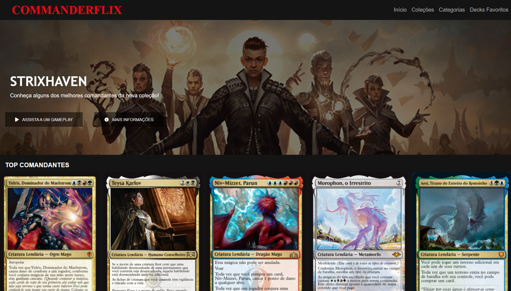

# Commanderflix

At first a clone of Netflix's webpage from a project on Digital Innovation One platform, Commanderflix is a concept for a Magic the Gathering focused page, 
specifically for the commander format, that aims to assist players in choosing a deck to play, managing favorite decks

 
